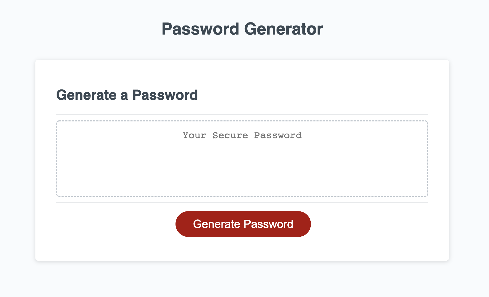

# Password Generator

## Description

This week’s Challenge requires you to create an application that an employee can use to generate a random password based on criteria they’ve selected. This app will run in the browser, and will feature dynamically updated HTML and CSS powered by JavaScript code that you write. It will have a clean and polished user interface that is responsive, ensuring that it adapts to multiple screen sizes.

## Table of Contents

1. [Deployed Page](#deployed-page)
2. [Acceptance Criteria](#acceptance-criteria)
3. [Comments](#comments)
4. [URL of Deployed Application](#url)
5. [Credits](#credits)

## Deployed Page

## Acceptance Criteria

GIVEN I need a new, secure password
WHEN I click the button to generate a password
THEN I am presented with a series of prompts for password criteria
WHEN prompted for password criteria
THEN I select which criteria to include in the password
WHEN prompted for the length of the password
THEN I choose a length of at least 8 characters and no more than 128 characters
WHEN asked for character types to include in the password
THEN I confirm whether or not to include lowercase, uppercase, numeric, and/or special characters
WHEN I answer each prompt
THEN my input should be validated and at least one character type should be selected
WHEN all prompts are answered
THEN a password is generated that matches the selected criteria
WHEN the password is generated
THEN the password is either displayed in an alert or written to the page

## Comments

1. Got references to the #generate element.
2. Created a generate password function.
3. Created empty arrays.
4. Created function that let user choose password length between 8 and 128.
5. Provided password options that required user to select at least one.
6. Set conditions of the arrays depending on choices by user.
7. Wrote code that generated a random password based on the user's choices. 

## URL of Deployed Application

[Deployed Gitpage](https://nverhulp.github.io/password-generator/)

## Credits

1. Article about concat function by [MDN](https://developer.mozilla.org/en-US/docs/Web/JavaScript/Reference/Global_Objects/Array/concat)